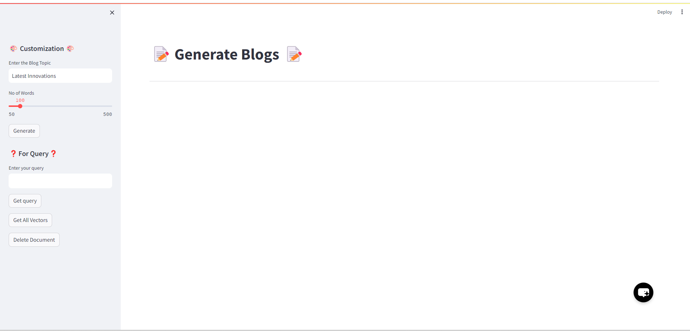
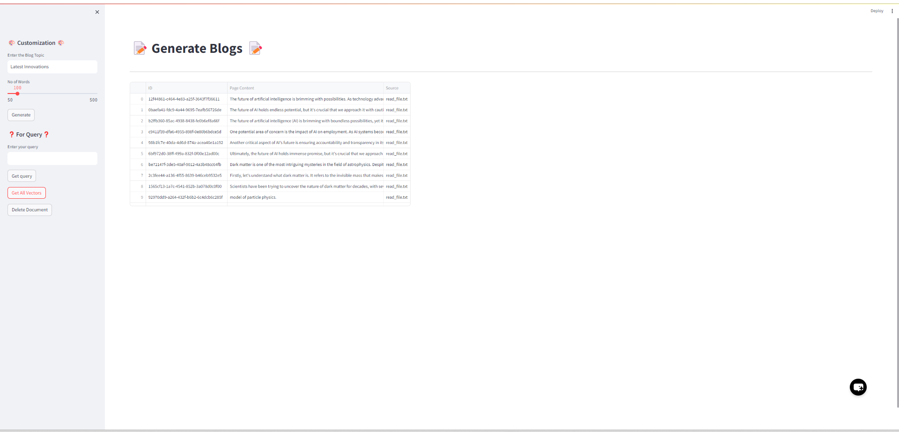
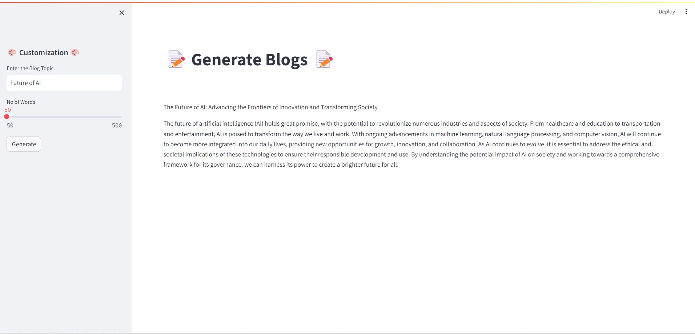

# Blog Generator

This is a web application built with Streamlit that allows users to generate blog content using the LLama 2 language model.

Python 3.12.2

## Installation

1. Clone the repository:

    ```
    https://github.com/yashsanghani-VS/Ollama.git
    ```

3. Create a virtual environment (optional but recommended):
    ```
    conda create -p venv python==3.12 --y
    ```


4. Activate the virtual environment:
   
- On Windows:
  ```
  venv\Scripts\activate
  ```
- On macOS and Linux:
  ```
  conda activate venv
  ```

5. Install the required dependencies:

  ```
  pip install -r requirements.txt
  ```


## Usage

1. Run the Streamlit app:

   ```
    streamlit run app.py
    ```
2. Access the application in your web browser at `http://localhost:8080`.

3. Enter the blog topic and the desired number of words in the input fields.

4. Click the "Generate" button to generate the blog content.


## Screenshots





